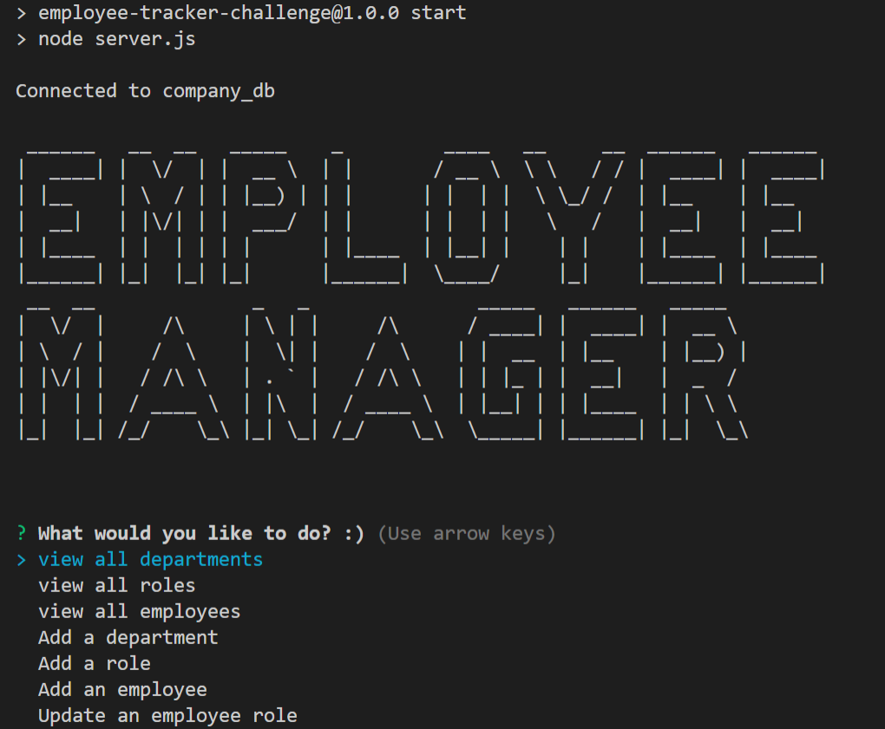

# 12 SQL: Employee Tracker

## Description

For this assignment we were tasked with building a command-line application from scratch to manage a company's employee database, using Node.js, Inquirer, and MySQL. The application will be able to (show all departments, show all roles, show all employees, add department, add role, add employee and update employee)


## Table of Contents:
- [Installation](#installation)
- [Usage](#usage)
- [Mockup](#mockup)
- [Video](#video)
- [Credits](#credits)


## Installation

The applications dependancies will be installed by using the following command:

```bash
nmp i
```

## Usage

First the user must enter their mysql password into the .env file 

Then

The user must create and seed the database by entring the following commands:
```bash
mysql -uroot -p
mysql> source ./db/schema.sql
mysql> source ./db/seeds.sql
```

Then

The application will start with the following command:
```bash
npm start
```


## Mockup

---

## Video
[YouTube Video Link](https://youtu.be/Z2hpzheFXUc)

## Credits
Software Developer: Dylan Knight